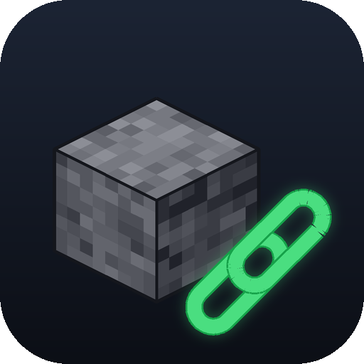
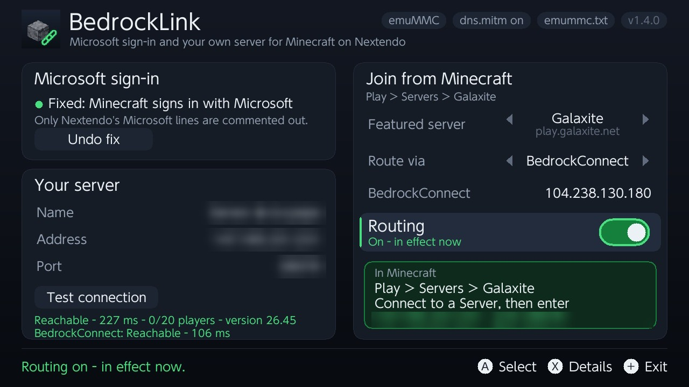
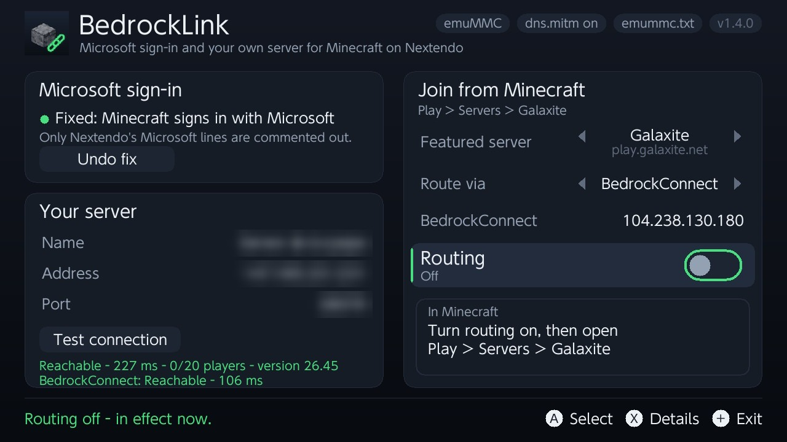

<p align="center"></p>

# BedrockLink

Homebrew for a modded Nintendo Switch that runs Minecraft (Bedrock) on an emuMMC
with Nintendo's servers replaced or blocked:

1. **Microsoft sign-in fix.** Some community-server setups (Nextendo's Prelude, from
   3.5.7) redirect Microsoft's sign-in servers in Atmosphère's hosts file, so
   Minecraft can't sign in to your Microsoft account. BedrockLink turns off just
   those lines.
2. **Join your own server.** Minecraft on Switch has no "Add Server" button.
   BedrockLink turns one featured server in **Play > Servers** (Galaxite, The Hive,
   ...) into a door to the server you choose, through
   [BedrockConnect](https://github.com/Pugmatt/BedrockConnect) (any port) or
   directly (servers on port 19132).

Everything is done with one or two clearly marked lines in Atmosphère's hosts file.
Nintendo's lines are never touched: every change is checked first, backed up, and
takes effect at once, without a restart.

<p align="center">
  
  
</p>
<p align="center"><sub>Screenshots from a Switch; the server's details are blurred.</sub></p>

## Requirements

- A Switch running **Atmosphère** with an **emuMMC** and `dns.mitm` on (Atmosphère's
  default).
- **Minecraft** (Bedrock) for Switch and a **Microsoft account**.
- To join your own server: a Bedrock or Geyser server, and its address and port.
- Optional: **Ultrahand** or **Tesla Menu** for the overlay.

## Install

Download `BedrockLink-<version>.zip` from the
[releases](../../releases) and unzip it to the root of the SD card:

```
switch/BedrockLink/BedrockLink.nro     the app (homebrew menu)
switch/.overlays/bedrocklink.ovl       the overlay (optional)
```

## Use

Open **BedrockLink** from the homebrew menu.

**Microsoft sign-in.** If the card says *Broken*, select **Fix sign-in**. Minecraft
then signs in with the real Microsoft (Play > Sign in, then enter the code at
aka.ms/remoteconnect). If you switch modes in Prelude later, it rewrites the hosts
files: open BedrockLink and fix the sign-in again.

**Your server.**

1. Under *Your server*, set the name, address and port. **Test connection** checks
   that the console can reach it.
2. Under *Join from Minecraft*, pick the **featured server** to use (Left/Right). Pick
   one you don't play on: while routing is on, it leads to your server instead.
3. Pick the **route**:
   - **BedrockConnect** (default): works with any port. Uses the public
     BedrockConnect server unless you set your own.
   - **Direct**: only for servers on port 19132; no third party involved.
4. Switch **Routing** on. It takes effect at once.
5. In Minecraft: **Play > Servers >** the featured server you picked.
   - With BedrockConnect, its menu opens: choose **Connect to a Server** and enter
     your server's address and port (the app shows them). BedrockConnect remembers
     it for next time.
   - With Direct, you join your server straight away.

Switch **Routing** off when you want the real featured server back. The overlay
(*BedrockLink* in Ultrahand/Tesla) has the same on/off switch.

Press **X** in the app for details: where each Microsoft and Nintendo host goes, and
the state of each hosts file.

### Privacy

When you join through BedrockConnect, its server sees your gamertag (as any server
you join does) and stores the servers you save in its menu. If you'd rather not use
the public one, run your own [BedrockConnect](https://github.com/Pugmatt/BedrockConnect)
and enter its address in the app, or use Direct.

BedrockLink itself contacts nothing on its own; *Test connection* sends one status
ping to your server and to the BedrockConnect server.

## Good to know

- **Why not a relay on the console?** Featured servers always connect on port 19132,
  and Minecraft won't join an address on the console itself, so the join has to go
  to another machine: BedrockConnect, or your server on 19132. Details in
  [docs/how-it-works.md](docs/how-it-works.md).
- **Other featured servers** and the rest of Minecraft's online services are not
  changed.
- **Backups** of every hosts file BedrockLink changed are in
  `/switch/BedrockLink/backup/` and `/config/bedrocklink/backup/`; everything it did
  is logged in `/switch/BedrockLink/log.txt`.
- **Use at your own risk.** BedrockLink doesn't contact Nintendo and never edits
  Nintendo lines, but it can't make any promise about what Nintendo, Microsoft or
  a game does.

### Tested on

Switch (Mariko), firmware 22.5.0, Atmosphère 1.11.2, emuMMC, Minecraft 1.26.44,
Nextendo Prelude 3.5.5 and 3.5.11, with 90DNS as the network's DNS.

## Build

Needs Docker; devkitPro runs in a container.

```bash
./build.sh                  # the app, the overlay and dist/BedrockLink-<version>.zip
./tests/run_pc_tests.sh     # hosts and routing logic, on the PC
./tests/run_pc_gui.sh "ADADA" "My Server|203.0.113.10|19132"   # the GUI on the PC, a screenshot per button press
```

`tools/` has the logo generator, the screenshot redaction tool, a reader for
Atmosphère's DNS debug log and `lan_relay.py` (a LAN relay for a PC, kept from
development).

## Credits

- [BedrockConnect](https://github.com/Pugmatt/BedrockConnect) by Pugmatt (GPL-3.0):
  the in-game server list and transfer that make any port work.
- [Atmosphère](https://github.com/Atmosphere-NX/Atmosphere): `dns.mitm` and its
  hosts reload command.
- [libtesla](https://github.com/WerWolv/libtesla) by WerWolv (GPL-2.0): the overlay.
- devkitPro, libnx, SDL2.

BedrockLink is not affiliated with Nintendo, Microsoft, Mojang, Nextendo or
BedrockConnect. Minecraft is a trademark of Mojang/Microsoft.

## License

GPL-2.0-or-later. See [LICENSE](LICENSE). `third_party/libtesla` is GPL-2.0.
