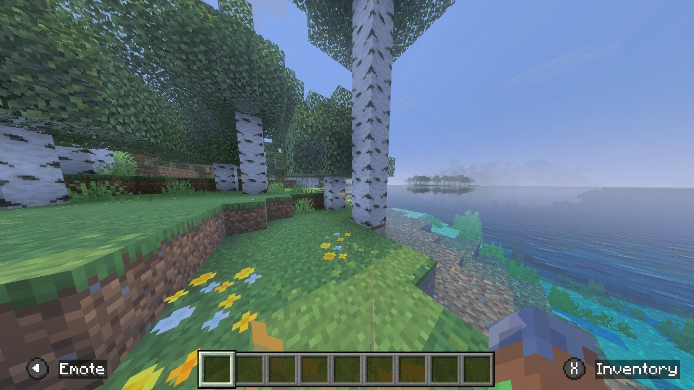
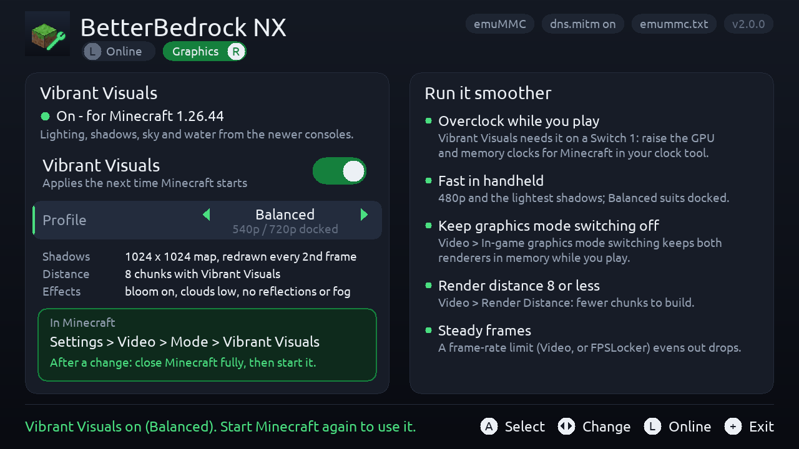
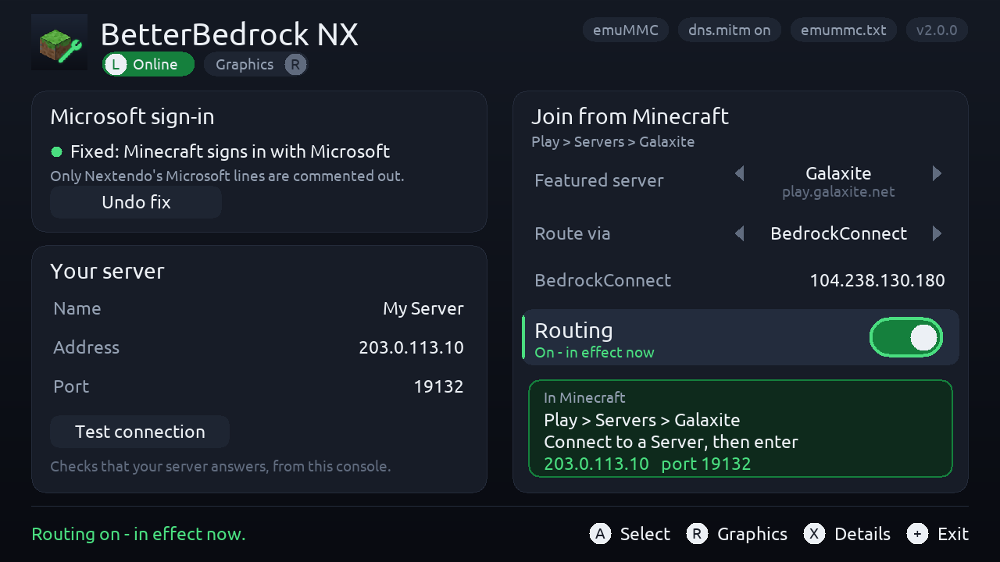

<p align="center"></p>

# BetterBedrock NX

A Minecraft (Bedrock) toolkit for a modded Nintendo Switch on Atmosphère. Formerly
**BedrockLink**.

- **Microsoft sign-in fix.** Some community-server setups (Nextendo's Prelude, from
  3.5.7) redirect Microsoft's sign-in servers in Atmosphère's hosts file, so Minecraft
  can't sign in to your Microsoft account. BetterBedrock NX turns off just those lines.
- **Join your own server.** Minecraft on Switch has no "Add Server" button. One
  featured server in **Play > Servers** becomes a door to the server you choose,
  through [BedrockConnect](https://github.com/Pugmatt/BedrockConnect) (any port) or
  directly (servers on port 19132).
- **Vibrant Visuals on a Switch 1.** The original Switch's Minecraft has Vibrant
  Visuals built in but switched off. BetterBedrock NX switches it on (Minecraft
  1.26.44), with **Fast / Balanced / Quality** profiles tuned for the Switch 1.
- **An overlay** (Ultrahand/Tesla) to switch server routing on and off in game.

<p align="center">
  
</p>
<p align="center"><sub>Vibrant Visuals on an original Switch (Mariko, handheld, overclocked).</sub></p>

<p align="center">
  
  
</p>
<p align="center"><sub>The app's two pages (PC preview build, sample server).</sub></p>

## Who it's for

Anyone who plays Minecraft (Bedrock) on a Switch that stays off Nintendo's servers:

- an **emuMMC with Nintendo's servers blocked** (90DNS, a DNS blocker or Atmosphère's
  hosts file), or
- a **banned console**,

with a community server setup such as Nextendo's Prelude for online play (that's what
it's tested with). Vibrant Visuals works offline too. BetterBedrock NX never contacts
Nintendo and never changes the hosts lines that keep Nintendo blocked. So far it has
been tested on a console that isn't banned; reports from banned consoles are welcome.

## Requirements

- A Switch running **Atmosphère** with an **emuMMC** and `dns.mitm` on (Atmosphère's
  default).
- **Minecraft** (Bedrock) for Switch and a **Microsoft account**.
- To join your own server: a Bedrock or Geyser server, and its address and port.
- For Vibrant Visuals: **Minecraft 1.26.44** exactly (other versions simply don't get
  the patch), and an **overclock** (sys-clk, Horizon OC or similar) - it isn't playable
  at stock clocks.
- Optional: **Ultrahand** or **Tesla Menu** for the overlay.

## Install

Download `BetterBedrockNX-<version>.zip` from the [releases](../../releases) and unzip
it to the root of the SD card:

```
switch/BetterBedrockNX/BetterBedrockNX.nro   the app (homebrew menu)
switch/.overlays/betterbedrock-nx.ovl        the overlay (optional)
```

**Coming from BedrockLink?** Your server settings carry over. The first start removes
the old BedrockLink app and overlay files (so you don't get two overlays); its old
`/switch/BedrockLink` folder (log and backups) is left for you to delete.

## Use

Open **BetterBedrock NX** from the homebrew menu. **L** and **R** switch between its
two pages; touch works too.

### Online

**Microsoft sign-in.** If the card says *Broken*, select **Fix sign-in**. Minecraft
then signs in with the real Microsoft (Play > Sign in, then enter the code at
aka.ms/remoteconnect). If you switch modes in Prelude later, it rewrites the hosts
files: open the app and fix the sign-in again.

**Your server.**

1. Under *Your server*, set the name, address and port. **Test connection** checks
   that the console can reach it.
2. Under *Join from Minecraft*, pick the **featured server** to use (Left/Right). Pick
   one you don't play on: while routing is on, it leads to your server instead.
3. Pick the **route**:
   - **BedrockConnect** (default): works with any port. Uses the public
     BedrockConnect server unless you set your own.
   - **Direct**: only for servers on port 19132; no third party involved.
4. Switch **Routing** on. It takes effect at once.
5. In Minecraft: **Play > Servers >** the featured server you picked.
   - With BedrockConnect, its menu opens: choose **Connect to a Server** and enter
     your server's address and port (the app shows them). BedrockConnect remembers
     it for next time.
   - With Direct, you join your server straight away.

Switch **Routing** off when you want the real featured server back. The overlay has
the same on/off switch. Press **X** for details: where each Microsoft and Nintendo
host goes, and the state of each hosts file.

### Graphics

1. Switch **Vibrant Visuals** on and pick a **profile**:

   | | Fast | Balanced | Quality |
   |---|---|---|---|
   | Resolution, handheld / docked | 480p / 540p | 540p / 720p | 720p / 720p |
   | Shadows | 1024 map, every 2nd frame, no cloud shadows | 1024, every 2nd frame | 2048, every frame |
   | Vibrant Visuals distance | 6 chunks | 8 chunks | 10 chunks |
   | Effects | no bloom | bloom | bloom, light reflections and fog |

2. Close Minecraft fully if it's running, then start it.
3. In Minecraft: **Settings > Video > Mode > Vibrant Visuals**.

Changes apply the next time Minecraft starts. Switching Vibrant Visuals off in the
app removes everything it installed. What to expect: on a Mariko Switch in handheld
with a high overclock, Vibrant Visuals ran at **20-25 fps with Mojang's own settings**;
the profiles are lighter than those. It is not playable at stock clocks.

**Run it smoother** (also on the Graphics page): overclock the GPU and memory while
you play; use Fast in handheld; keep *In-game graphics mode switching* off (it keeps
both renderers in memory); keep the render distance at 8 chunks or less; set a frame
rate limit (Video settings or FPSLocker) to even out drops.

How the unlock works, and exactly what it changes: [docs/vibrant-visuals.md](docs/vibrant-visuals.md).

### Privacy

When you join through BedrockConnect, its server sees your gamertag (as any server
you join does) and stores the servers you save in its menu. If you'd rather not use
the public one, run your own [BedrockConnect](https://github.com/Pugmatt/BedrockConnect)
and enter its address in the app, or use Direct.

The app contacts nothing on its own; *Test connection* sends one status ping to your
server and to the BedrockConnect server.

## Good to know

- **Why not a relay on the console?** Featured servers always connect on port 19132,
  and Minecraft won't join an address on the console itself, so the join has to go
  to another machine: BedrockConnect, or your server on 19132. Details in
  [docs/how-it-works.md](docs/how-it-works.md).
- **Other featured servers** and the rest of Minecraft's online services are not
  changed.
- **Minecraft updates:** the Vibrant Visuals patch matches one exact build. After a
  game update it is skipped (Minecraft runs as normal) until BetterBedrock NX is
  updated for the new version.
- **Files it writes:** the hosts files (one marked block, plus the sign-in fix),
  `/config/betterbedrock-nx/`, and for Vibrant Visuals
  `/atmosphere/exefs_patches/betterbedrock-nx-vv/` and three files under
  `/atmosphere/contents/0100D71004694000/romfs/`. Backups of every hosts file it
  changed are in `/switch/BetterBedrockNX/backup/` and `/config/betterbedrock-nx/backup/`;
  everything it did is logged in `/switch/BetterBedrockNX/log.txt`.
- **Use at your own risk.** BetterBedrock NX doesn't contact Nintendo and never edits
  Nintendo lines, but it can't make any promise about what Nintendo, Microsoft or a
  game does.

### Tested on

Switch (Mariko), firmware 22.5.0, Atmosphère 1.11.2, emuMMC, Minecraft 1.26.44,
Nextendo Prelude 3.5.5 and 3.5.11, with 90DNS as the network's DNS; Horizon OC for
the overclock.

## Build

Needs Docker; devkitPro runs in a container.

```bash
./build.sh                  # the app, the overlay and dist/BetterBedrockNX-<version>.zip
./tests/run_pc_tests.sh     # hosts, routing and graphics logic, on the PC
./tests/run_pc_gui.sh "ArA" "My Server|203.0.113.10|19132"   # the GUI on the PC, a screenshot per button press
```

`tools/` has the logo and Homebrew App Store art generators, the screenshot redaction
tool, a reader for Atmosphère's DNS debug log and `lan_relay.py` (a LAN relay for a
PC, kept from development).

## Credits

- [BedrockConnect](https://github.com/Pugmatt/BedrockConnect) by Pugmatt (GPL-3.0):
  the in-game server list and transfer that make any port work.
- [Atmosphère](https://github.com/Atmosphere-NX/Atmosphere): `dns.mitm`, its hosts
  reload command, exefs patches and LayeredFS.
- [libtesla](https://github.com/WerWolv/libtesla) by WerWolv (GPL-2.0): the overlay.
- [th4llium's vibrant-visuals-patcher](https://github.com/th4llium/vibrant-visuals-patcher)
  (Windows) and [BetterRenderDragon](https://github.com/ddf8196/BetterRenderDragon):
  where to start looking for the Vibrant Visuals gate.
- devkitPro, libnx, SDL2.

BetterBedrock NX is not affiliated with Nintendo, Microsoft, Mojang, Nextendo or
BedrockConnect. Minecraft is a trademark of Mojang/Microsoft.

## License

GPL-2.0-or-later. See [LICENSE](LICENSE). `third_party/libtesla` is GPL-2.0.
